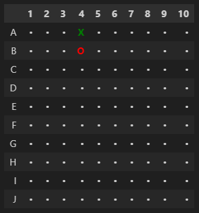
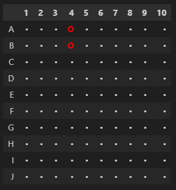
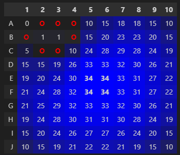
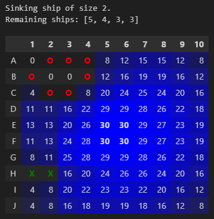
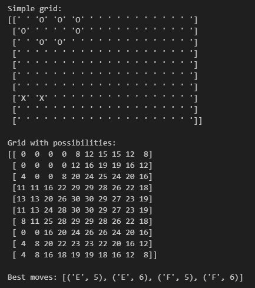

# battleship
A Python simulator for iterating over possible board layouts to optimize Battleship strategy and gameplay. This simulator was inspired by Digital Genius\' [video on YouTube](https://www.youtube.com/watch?v=8FctDuTfcO8), so go check it out! The simulator is also available as a [Streamlit app](placeholder).

## Usage

### Directly from the main class
To run the simulator, simply import its class `BattleshipBoard` from `src/game.py`. Then, instantiate a board with the desired settings, and then call the class instance methods to take actions on the board. For example:

```python
from src.game import BattleshipBoard

# Instantiate a board with the default settings
board = BattleshipBoard()

# Launch a single torpedo, and mark it as a hit
board.mark_hit('A', 4)

# Now launch a torpedo that misses
board.mark_miss('B', 4)

# Check out the board's current state
board.print_board()
```

This will display the following board:



You can also undo plays. Imagine that you accidentally marked the previous torpedo as a hit, when it was actually a miss. You can undo that play, and then mark it as a miss:

```python
# Undo the previous hit, and mark it as a miss
board.undo_play('A', 4)
board.mark_miss('A', 4)

# Check out the board's current state
board.print_board()
```

What was previously a green "X" denoting a hit is now a red "O" denoting a miss on cell A4:




You can also use this simulator to compute the best possible target to hit next, given the current state of the board. For example, let's take the previous previous board state, and compute the probability board, i.e. in how many different layouts could each cell contain a ship::

```python
# Add some more misses
board.mark_miss('A', 2)
board.mark_miss('B', 1)
board.mark_miss('A', 3)
board.mark_miss('C', 2)
board.mark_miss('C', 3)

# Print the probability board
board.print_board(possibilities=True)
```

This displays the same board as before, but now each cell that is neither a hit or a miss contains a number representing the number of possible layouts in which that cell contains a ship. Also, there is a color gradient of blue, where darker blue represents a higher number of possibilities.

Also, since there are no ships of size 1, then it is impossible for cell A1 to contain a ship, so its probability is 0:



But what if you sink a ship? Well, then you should update the board to reflect that. For example, if the only ship of size 2 is sunk, and there is a position on the board where only that ship could have been (e.g.: from B2 to B3), then these cells should have a probability of 0:

```python
# Assume we just sent two torpedos anf both are hits
board.mark_hit('H', 1)
board.mark_hit('H', 2)

# We are then informed by our opponent that the ship of size 2 is sunk
board.mark_ship_sunk(2)

# See remaining ships
print(f'Remaining ships: {board.ship_sizes}')

# Print the probability board
board.print_board(possibilities=True)
```

Notice how there are now no possibilities for cells B2 and B3, since only a ship of size 2 could fit there, and we know that ship is sunk:



What if I don't want, or can't display the board eveytime, but still want to optimize my next move? Well, you can either print the board grid (with or without possibilities), which is a 2D array of strings, or you can ask for the best moves directly. I suggest converting the grids to numpy arrays before printing them, since they are easier to read:

```python
import numpy as np

# Print the board grid (without possibilities)
print('Simple grid:')
print(np.array(board.grid), end='\n\n')

# Print the board grid (with possibilities)
board.calculate_possibilities()
print('Grid with possibilities:')
print(np.array(board.possibility_grid), end='\n\n')

# Get the best moves
print(f'Best moves: {board.find_best_targets()}')
```

This prints the following:



### With Streamlit

You can also run the simulator with a Streamlit app (graphical user interface). To do so, simply clone this repository, install the requirements, and run the app:

```bash
streamlit run src/app.py
```

This will open a new tab in your browser with the app. You can then play around with the simulator, and see how the board changes as you mark hits and misses, and as you sink ships.
